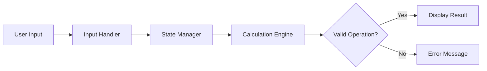

# Architecture

## Overview
The simple calculator web app follows a lightweight client-side architecture designed for clarity and maintainability. It separates the UI, calculation logic, and state handling so that the app remains easy to test and extend.

## Components

### 1. Calculator UI
Responsible for rendering the number pad, operator buttons, display area, and clear/equals actions.

### 2. Input Handler
Captures user interaction from the keyboard or button clicks and validates the current expression before evaluation.

### 3. Calculation Engine
Performs arithmetic operations and returns the correct result while handling edge cases like division by zero or malformed input.

### 4. State Manager
Tracks the current expression, result, and validation status so the UI reflects the latest user action.

### 5. Error Display Layer
Shows friendly feedback when the user enters invalid input or attempts an unsupported operation.

## Data Flow

## Technology Choices
- HTML5 for page structure
- CSS for layout and responsiveness
- JavaScript for interaction and calculation logic
- Optional lightweight frontend testing framework for regression checks

## Design Decisions
- Keep the app logic simple and deterministic.
- Use a central calculation function rather than duplicate arithmetic logic across the UI.
- Treat invalid input and zero-division as explicit user-facing errors.
- Keep the UI responsive without adding unnecessary dependencies.

## Risks and Considerations
- Floating-point arithmetic can introduce precision issues in some operations.
- User input must be validated to avoid malformed expressions.
- Some browser behaviors may need accessibility improvements for keyboard and screen-reader support.
- Future versions may add memory functions, scientific mode, or backend persistence.
