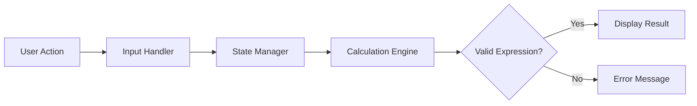

# Stage 2: Architecture Design

## Overview
The calculator web app follows a lightweight front-end architecture that separates the user interface, input handling, calculation logic, and error feedback. This keeps the system simple, maintainable, and suitable for a capstone demo or small production feature.

## High-Level Components
### 1. Calculator UI
Renders the display, operators, buttons, and reset flow for the end user.

### 2. Input Handler
Captures button and keyboard inputs, collects the current expression, and validates it before evaluation.

### 3. Calculation Engine
Executes arithmetic operations and returns a result or an error state.

### 4. State Manager
Tracks the current expression, result, and validation status for the UI.

### 5. Error Display Layer
Surfaces friendly messages for invalid expressions, malformed input, and division by zero.

## Data Flow

## Design Decisions
- Keep the application focused on core arithmetic rather than advanced scientific features.
- Centralize arithmetic logic in a single calculation function to reduce duplication.
- Validate user input before attempting evaluation to prevent malformed expressions.
- Keep the user interface simple, responsive, and accessible to a broad audience.
- Treat invalid input as a recoverable UI state rather than a fatal application error.

## Risks
- Floating-point calculation can introduce rounding issues in some cases.
- User input may be malformed if validation is incomplete.
- Browser behavior and keyboard accessibility need careful testing.
- The first version deliberately excludes advanced calculator features and persistence.

## Approval Gate
Human approval is required before implementation begins to confirm that the calculator scope and user-facing behavior match the requirements.
